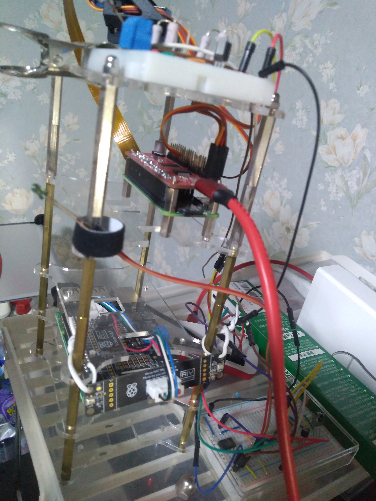

# 自作スマートスピーカー

RaspberryPi及びGoogle AIY Voice Kit V2を利用する。  

Google AIY Voice Kit V2がRaspberryPiのすべてのピンを専有する為、各種センサー・赤外線送信用と合わせてRaspberryPi2台で運用する。

* RaspberryPi 3 Model B+ : Google AIY Voice Kit V2用
* RaspberryPi Zero WH    : 各種センサー・赤外線送信用

# 構成

* RaspberryPi 3 Model B+ 
  * smart_speaker.py: メインのプログラム。Google Assistantのライブラリを利用。独自の音声コマンドを受け付ける為にsnowboyを使用。
  * notifier: 合成音声エンジンを利用してメッセージを再生させる用。
* RaspberryPi Zero WH
  * infrared: 赤外線送信用・赤外線受信機で記録し、そのデータを利用して赤外線送信する。
  * web: 音声コマンドだけでなく、WEB上からも操作できるようにする為。

